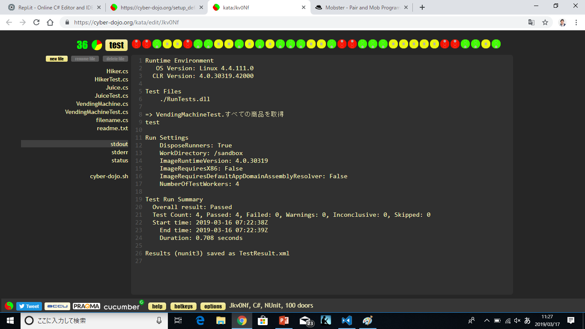

# Agile Japan 2018 札幌サテライト モブプログラミング

## チームC#
交代：8分  
役割：タイピスト、その他のモブ（ナビゲーター、ふりかえり後にグーグラー追加)  
言語：C#

## 自動販売機を作る！！  

ほしい機能を付箋に書き出し、優先順番の高い方から順番に実装  
- ジュースを作る
- 自動販売機からすべての商品を取得する
- ジュースを1つ買う
- ジュースを連続して買う
- お釣りを戻す

## 開発環境

cyber‑dojo(https://cyber-dojo.org/)

グリーンになったら”YATTAH!!”ってみんなで言う（15回やったー）

